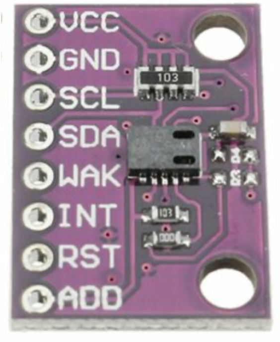
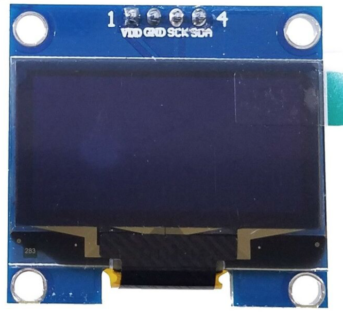
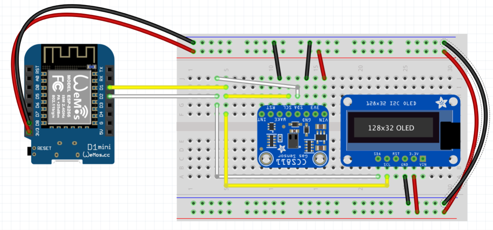

# Arduino: VOC Sensor

## Parts

### CCS811 VOC-Sensor
CJMCU-811 CCS811

https://revspace.nl/CJMCU-811
https://www.adafruit.com/product/3566

> “AMS recommends that you run this sensor for 48 hours when you first receive it to "burn it in", and then 20 minutes in the desired mode every time the sensor is in use. This is because the sensitivity levels of the sensor will change during early use.”

- TVOC -  Total Volatile Organic Compounds  - Gesamt flüchtige organische Verbindungen
- CO2 -- 400 ppm is baseline

### SH1106 OLED-Display
1,3"  SH1106 128x64 I2C

Driver:
https://github.com/rene-mt/esp8266-oled-sh1106

Example:
https://github.com/rene-mt/esp8266-oled-sh1106/blob/master/examples/SH1106Demo/SH1106Demo.ino

“The SH1106 is in general similar to the SSD1306”

Normally it also works with 5V, but on breadboard it crashes, but not with 3,3V, so just use this.

## Prototype with Fritzing

https://steve.fi/Hardware/d1-pins/ 
SDA => D2
SCL => D1

https://projetsdiy.fr/test-du-ccs811-iaq-capteur-qualite-air-tcov-eco2-i2c-arduino-esp8266/

## Code
https://learn.adafruit.com/adafruit-ccs811-air-quality-sensor/arduino-wiring-test

I2C from OLED and VOC are separated, because VOC uses I2C clock stretching ([issue](https://github.com/adafruit/Adafruit_CCS811/issues/4
))

### SH1106 OLED

SDA -> D4
SDC -> D3

Addr: 0x3C

~~https://github.com/rene-mt/esp8266-oled-sh1106~~
~~I2C untested, don't work with it.~~

https://github.com/durydevelop/arduino-lib-oled

works with following setup:
OLED display = OLED(D4, D3, NO_RESET_PIN, 0x3C, 128, 64, true);

### CCS811 VOC-Sensor

SDA -> D2 (default)
SDC -> D1 (default)

Addr: 0x5A

